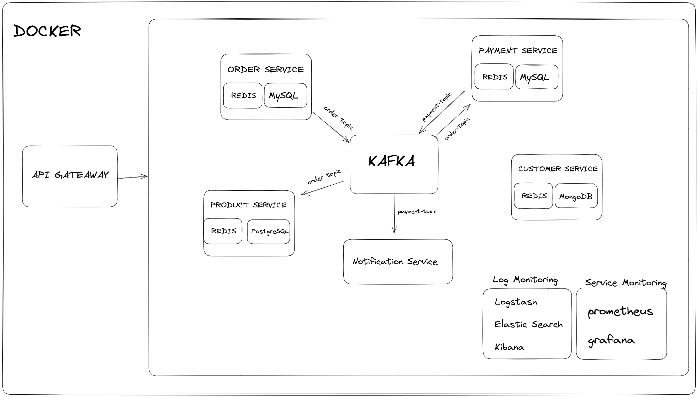

# Description
Implementation of a REST Microservices for an E-Commerce Project with Spring Boot.  

**Tech Stack**: MySQL, MongoDB, PostgreSQL, Redis, Kafka, Prometheus, Grafana, Docker, Docker Compose, Elastic Search, Logstash, Kibana, Spring Cloud Gateway, Swagger

## Getting Started

### Dependencies
* Maven
* Java 17
* Docker / Docker Compose

### Installation and Running 
First, clone the project using the following command:    
```shell
git clone https://github.com/serhhatsari/e-commerce-backend
```  

Then, you need to build every service by running the build script:  
```shell
cd scripts && chmod +x build.sh && ./build.sh && cd ..
```

Finally, you can run the project using docker compose:    
```shell
docker compose up --build
```
### Swagger 
You can access the swagger page of the services at:  
- Product Service: `localhost:8081/api/docs`  
- Order Service: `localhost:8082/api/docs`  
- Payment Service: `localhost:8083/api/docs`  
- Customer Service: `localhost:8084/api/docs`

### ELK Stack
You can access the kibana at 5601 port.  

### Prometheus & Grafana
You can access the grafana dashboard at 3000 port.  
Default user and password are both admin.  

### Kafka UI 
You can access the Kafka UI at 9093 port. 

## Project Architecture  

